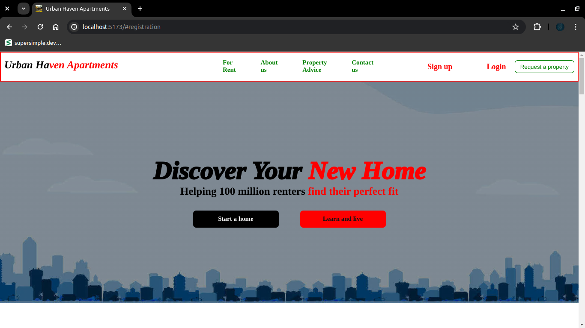

# Urban Haven Apartments Landing Page

## Project Overview

This repository contains the source code for the Urban Haven Apartments landing page. Urban Haven Apartments is a rental business located in Murang'a, Kiharu, with over 12 years of experience. This landing page aims to provide potential tenants with essential information about the apartments, including types of available spaces, prices, amenities, location, and contact details. The page is designed to encourage visitors to inquire further or book a viewing.

## Table of Contents

- [Available Spaces](#available-spaces)
- [Amenities](#amenities)
- [Contact Information](#contact-information)
- [Contact Form](#contact-form)
- [Deployment](#deployment)
- [Technologies Used](#technologies-used)
- [Picture of website](#tip-of-the-website)

## Available Spaces

Urban Haven Apartments offers a variety of living spaces to suit different needs and budgets:

1. **Single Rooms**: Kshs. 3500/month
1. **Bedsitters**: Kshs. 5500/month
1. **Studio Apartments**: Kshs. 7000/month
1. **One Bedroom Apartments**: Kshs. 8500/month
1. **Two Bedroom Apartments**: Kshs. 10000/month
1. **One Bedroom Self-Contained Apartments**: Kshs. 15000/month
1. **Two Bedroom Self-Contained Apartments**: Kshs. 20000/month

## Amenities

Urban Haven Apartments provides a range of amenities:

- Free wifi (except for Single Rooms)
- Free parking (except for Single Rooms and Bedsitters)
- On-site laundry: Kshs. 150 per basket
- Free gym (except for Single Rooms and Bedsitters)
- Free swimming pool access
- Elevator access
- Free water
- Community theatre

## Contact Information

You can reach Urban Haven Apartments via:

- **Phone**: +254718764327
- **Email**: urhaven@apartments.com
- **Social Media**:
  - [Facebook](#)
  - [Instagram](#)

## Contact Form

The landing page includes a contact form where users can input their first name, last name, email address, and a message to communicate with Urban Haven Apartments.

## Deployment

The landing page is deployed on [github](https://github.com/Gakiri001/urbanHavenApartments) for easy access and sharing.

- **Github URL**: [Urban Haven Apartments Landing Page](https://gakiri001.github.io/urbanHavenApartments/)

## Technologies Used

- **HTML5**: For structuring the content.
- **CSS**: For styling the content and layout.

## Tip of the website
